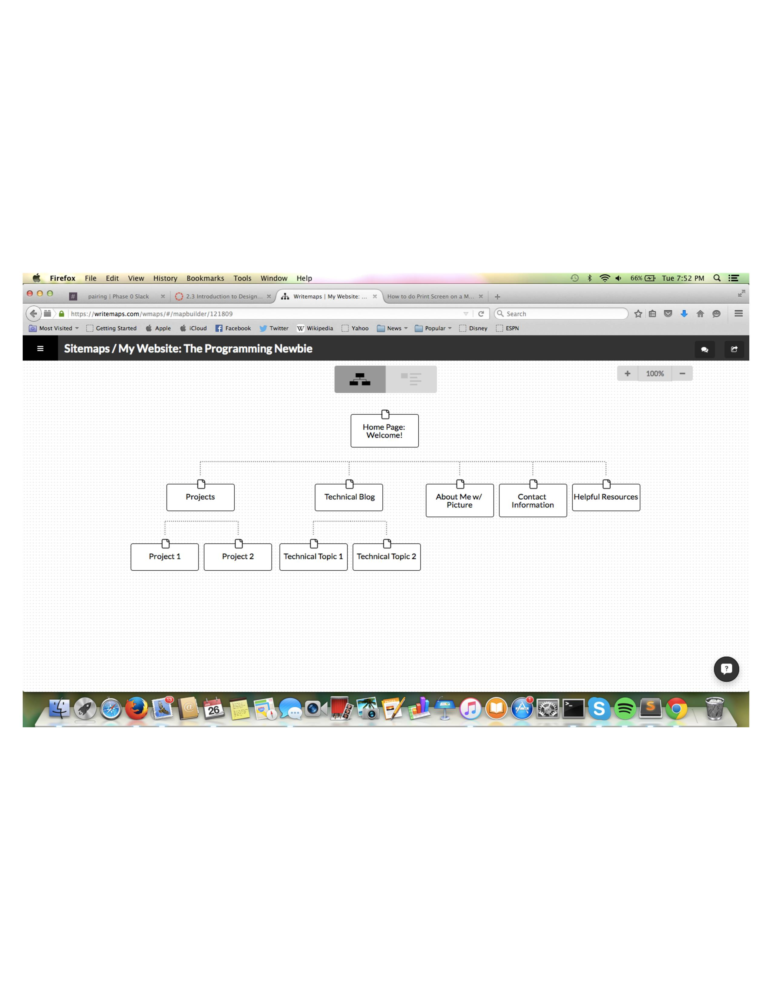

#Site Map Reflection

1. What are the 6 Phases of Web Design?

The 6 Phases of Web Design are Information Gathering, Planning, Design, Development, Testing and Delivery, and Maintenance.

2. What is your site's primary goal or purpose? What kind of content will your site feature?

My site's (The Programming Newbie) purpose is to expose aspiring programmers to the basic concepts of software development .  The technical topics in the blog are meant for beginners and easily understand.  In addition to the Blog, the website will also have a Contact Information section, About Me section, Helpful Resources section, and a Projects section.  The projects section will showcase the various projects I have completed throughout the course and specify what languages and concepts were used.

3. What is your target audience's interests and how do you see your site addressing them?

My target audience's interests is to research the basics of computer programming.  The audience is hoping to gain more insight into this field but is not extremely familiar with the overarching concepts, so the hope is that a beginner will be able to move forward with a better understanding of programming.    My target audience is also interested in seeing how these concepts and different languages are applied through concrete examples.  My site will address the interest of easy-to-follow descriptions of programming concepts through the blog.  The blog is meant for beginners and the audience can scroll through to pick which areas they are most interested in learning about.  My site addresses the interest of users looking for concrete examples of coding applications through my Projects section.  Users can see how code is applied in many different areas and how it is part of our daily interaction with the internet and those around us.

4. What is the primary "action" the user should take when coming to your site? Do you want them to search for information, contact you, or see your portfolio? It's ok to have several actions at once, or different actions for different kinds of visitors.

The primary "action" a user should take when visiting my site is to either begin at the Blog section or Projects section.  The user can visit the blog to read through basic programming concepts.  The user can also visit the Projects section when coming to my site if they would like to see the practical application of my work and how a new program can be built using basic applications.  The personal information and additional resources are meant to be used once the user has looked through the bulk of the website.

5. What are the main things someone should know about design and user experience?

Web design centers around usability, navigation, and accessibility.  In design and user experience, the main factor to consider is the target audience.  The look and feel of the website are based on what the ideal user is looking for.  The web designers and developers are looking to create a very specific user experience that makes the user feel a certain way.  These two aspects are closely intertwined and should be kept at top of mind when conceptualizing a web page.

6. What is user experience design and why is it valuable?

User experience, or UX design is how a person feels when interfacing with a system.  The main areas UX designers focus on is ease of use, perception of value, utility, and efficiency.  UX design is valuable because a website can be designed for a specific target audience with tailored goals.  The look and feel of a website can directly influence whether or not a user will return to the site, making it a crucial first step in maintaining and growing a user base.

7. Which parts of the challenge did you find tedious?

The part of the challenge I found most tedious was saving my site map properly and researching how to link my image to my md file via a relative path.  For my site map, I initially saved the document as a pdf file but needed to switch it to a jpg and move it to the imgs folder.  In addition, I was having difficultly figuring out how to implement the markdown command, which took a decent amount of research to figure out.  I am hoping to become more efficient with the processes as I move forward.

