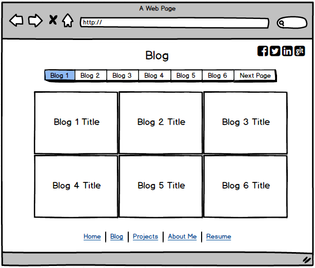

#Wireframe Reflection

What is a wireframe?

A wireframe is a tool that allows you to define the information hierarchy of your website design, making it easier to plan the layout of your website.

What are the benefits of wireframing?

Wireframing is beneficial because the user can plan the layout and structure of the website without the distraction of colors and typeface.  In addition, it is a way to determine how the user will interact with the userface.

Did you enjoy wireframing your site?

Yes, I enjoyed the creative process and drawing out various designs.  I chose to draw out my designs by hand first and then use a wireframing website to get a better idea of the layout.  I enjoyed moving through the different steps and making changes along the way.

Did you revise your wireframe or stick with your first idea?

I drew out a few ideas in the beginning and then narrowed it down to the one I liked best.  Once I chose the design, I revised it to make sure it was user-friendly and easy to navigate.

What questions did you ask during this challenge? What resources did you find to help you answer them?

One question I asked is what are popular wireframing designs.  To find this answer, I started my search online to see what resources were available. During my research, I saw that there is no perfect template and each design varies based on the goals of the website. I then chose to visit a few of my favorite websites to look at the structure and find inspiration for my own website. This process proved to be very helpful because I could mix and match parts of the design I liked best to make it my own.

Which parts of the challenge did you enjoy and which parts did you find tedious?

I enjoyed having the opportunity to be creative and design different templates for my website. The design process is fun because you can work through multiple ideas and continue revising until you have a design you are happy with. I also enjoyed the research portion I did by looking at the design of websites I visit regularly. A part of the challenge I found tedious was creating the wireframe in moqup.com. It takes a significant amount of time to make sure the sections are the proper size everything matches up properly.