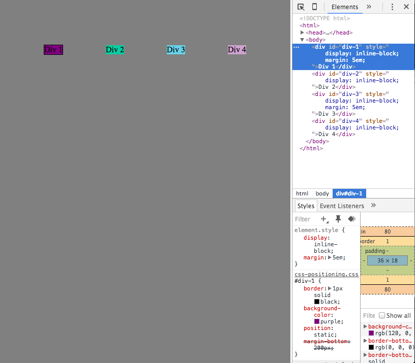

Reflection

How can you use Chrome's DevTools inspector to help you format or position elements?

Chrome's DevTools inspector is helpful for formatting or positioning elements because you can type in the CSS code within the Styles box.  It is helpful because once you enter in CSS code, you will be able to see the updates on your page immediately.  The inspector is a helpful way to test out different options and see how they will look on your webpage.

How can you resize elements on the DOM using CSS?

Using CSS, you can resize elements using the height and width element.  The sizing can be given in px or em.

What are the differences between absolute, fixed, static, and relative positioning? Which did you find easiest to use? Which was most difficult?

With absolute positioning, the item is removed from the normal flow of the webpage and is designated a specific position.  With fixed positioning, the item is anchored in a specific position and will remain in the same place as a user moves through the webpage. With static positioning, the item sits where the item would naturally be on the webpage. With relative positioning, the item is moved in relation to where it would have sat in the normal flow of the webpage. I found that the easiest to use is the static positioning because the item is not moved from where it would normally sit. I found absolute and fixed positioning the most difficult because I am still having trouble deciding which is the best option for what I am trying to create within the webpage.

What are the differences between margin, border, and padding?

Margin is the space around the item, and can be used to move elements around the page to be closer or further away from each other. Border is the edge of the item, and can be implemented using the border property in CSS. Padding is the space between the content of the item and the border. Padding allows for easier readability.

What was your impression of this challenge overall? (love, hate, and why?)

While I am not particularly enjoying the fine details that are involved with CSS, I did find this challenge helpful to better understand the different options that are available. I am finding it difficult to select the proper positionging and display elements, and it is very tedious when selecting the proper distances/sizes. However, it was nice to see the basic structures that are used in webpages and I plan to incorporate this into my personal webpage.

