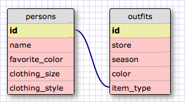

Challenge 8.4

Release 5

1. Select all data for states:
   SELECT * FROM states;

2. Select all data for all regions:
   SELECT * FROM regions;

3. Select the state_name and population for all states:
   SELECT state_name, population FROM states;

4. Select the state_name and population for all states ordered by population. The state with the highest population should be at the top. :
   SELECT state_name, population FROM states ORDER BY population DESC;

5. Select the state_name for the states in region 7:
   SELECT state_name FROM states WHERE region_id = 7;

6. Select the state_name and population_density for states with a population density over 50 ordered from least to most dense.
   SELECT state_name, population_density FROM states WHERE population_density > 50 ORDER BY population_density ASC;

7.  Select the state_name for states with a population between 1 million and 1.5 million people.
   SELECT state_name FROM states WHERE population BETWEEN 1000000 AND 1500000;

8. Select the state_name and region_id for states ordered by region in ascending order.

   SELECT state_name, region_id FROM states ORDER BY region_id ASC;

9. Select the region_name for the regions with "Central" in the name.
   SELECT region_name FROM regions WHERE region_name LIKE '%Central%';

10. Select the region_name and the state_name for all states and regions in ascending order by region_id. Refer to the region by name. (This will involve joining the tables).
   SELECT region_name, state_name FROM regions JOIN states ON regions.id = states.region_id ORDER BY region_id ASC;

Release 6 Schema

Reflection

What are databases for?  Databases store large amounts of information within specific tables and columns.

What is a one-to-many relationship?  A one-to-many relationship is a way to see if you should create two separate tables for your data.  It can be identified using the phrase "____ belongs to a ____. ___ has many ___."

What is a primary key? What is a foreign key? How can you determine which is which? A primary key uniquely identifies each row in a table.  The foreign key is used to link two tables together.

How can you select information out of a SQL database? What are some general guidelines for that?  To select information from a database, you use the SELECT 'item or *' FROM 'table_name' command.  This is the base command that will allow you to perform queries on your database.  Within the SELECT command, you can specify WHERE, LIKE, BETWEEN, and ORDER BY to make your query more specific.
