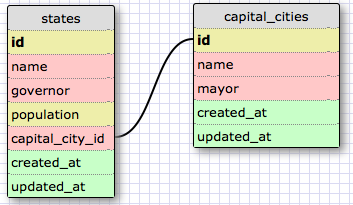
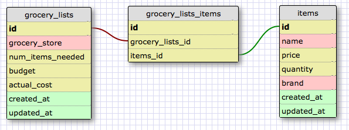

One to One Schema

Many to Many Schema

What is a one-to-one database?  A one-to-one database is when two things have a single relationship to one another.  They are considered a pair.

When would you use a one-to-one database? (Think generally, not in terms of the example you created).  You would use a one-to-one database when both things are considered a pair - there is only one option for each.

What is a many-to-many database?  A many-to-many database is when two distinct tables are connected together by a join table.  Both independent tables are related and the join table keeps track of the two foreign ids.

When would you use a many-to-many database? (Think generally, not in terms of the example you created).  You would use a many to many database when you have data that is related but should be held separately in its own independent table.  There are many options for each, and need to be connected by a join table to keep things clearly organized.

What is confusing about database schemas? What makes sense?  The more complex database schemas are confusing because I am still trying to understand how different tables are related to each other.  I am also still working through creating accurate field names that are relevant to the table.  I feel like I have a better understanding of one-to-one relationships because there is a specific pair.  Through my research and looking at examples, I am starting to become more comfortable with proper field names.  I find it very helpful to look at different examples to make the schema options more concrete.
